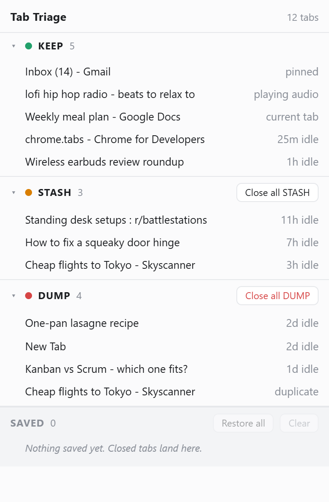

# Tab Triage

A Chrome extension that decides which tabs you can close.

Tab managers ask you to organise. Tab Triage sorts your open tabs into
three buckets and gives you one button per bucket. Nothing is closed
without being saved first.

**Manifest V3 · No build step · No frameworks · No network calls · Two permissions**



---

## The buckets

| Bucket | What lands here |
|--------|-----------------|
| **KEEP** | Used in the last 2 hours, pinned, playing audio, or currently active |
| **STASH** | Untouched for 2–24 hours |
| **DUMP** | Untouched for 24+ hours, or a duplicate URL |

Duplicates keep their most recently used copy as the canonical one; the
rest go to DUMP.

Every row shows *why* it landed where it did — `3h idle`, `duplicate`,
`pinned`, `playing audio`, `current tab`. The extension doesn't ask you
to trust a decision you can't see.

---

## Nothing is lost

This is the whole point of the extension, so it's enforced in the code
rather than left to good intentions:

- Tabs are written to the saved list **before** `chrome.tabs.remove` is
  called. If the close fails, the record still exists.
- Restoring creates the tab **before** deleting its saved entry. If the
  create fails, the record still exists.
- Pinned, audio-playing, and active tabs can never be closed by the
  bucket buttons.

Close a batch and an **Undo** bar appears — one click reopens all of
them. The Undo bar lives only in popup memory; the saved list beneath it
is the durable copy, so closing the popup never costs you anything.

The saved list holds 500 entries. At 501 the oldest is dropped.

---

## Privacy

Tab Triage makes **zero network requests**. Not for analytics, not for
updates, not for anything.

Favicons aren't shown in the popup. That's deliberate — displaying them
would mean fetching them, and that's a network request.

Permissions are `tabs` and `storage`. Nothing else. Everything stays in
`chrome.storage.local` on your machine.

---

## Install

Not on the Chrome Web Store. Load it unpacked:

1. Download or clone this repo
2. Open `chrome://extensions`
3. Turn on **Developer mode** (top right)
4. Click **Load unpacked** and select the folder
5. Pin the icon to your toolbar

The badge on the icon shows your current DUMP count. It hides itself at
zero.

---

## How it's put together

```
manifest.json      Manifest V3 config
triage.js          The bucketing rules and the 2h/24h constants
background.js      Service worker: records tab activity, updates the badge
popup.html/css/js  The popup
```

**`triage.js` is the only place the bucketing rules exist.** It's loaded
by `popup.html` as a plain script and by `background.js` via
`importScripts()`, so the badge count and the popup can never disagree
about what counts as a dead tab. Two copies of that logic would drift,
and the drift would be invisible.

`background.js` records when each tab was last used into
`chrome.storage.local`. On browser startup it re-seeds from Chrome's
`tab.lastAccessed`, because tab IDs are reassigned across restarts and
yesterday's ID means nothing today.

The badge is event-driven — it recalculates on tab create, close,
activate and navigate, debounced by 150ms. There's no `alarms`
permission, which means a tab crossing the 24-hour line joins the count
on the next tab event rather than the instant it qualifies. That's a
deliberate trade: one fewer permission, a slightly stale badge.

---

## Known limits

- The badge can lag until the next tab event (see above)
- Tab activity history resets if you clear extension storage
- Chrome only, and only with Manifest V3

---

## Why it exists

I kept 40+ tabs open because closing one felt like losing it. Every tab
manager I tried handed the decision back to me, which was the problem.
This one decides, shows its reasoning, and keeps a copy of everything it
touches.

Built with Claude Code.

---

## Licence

MIT
